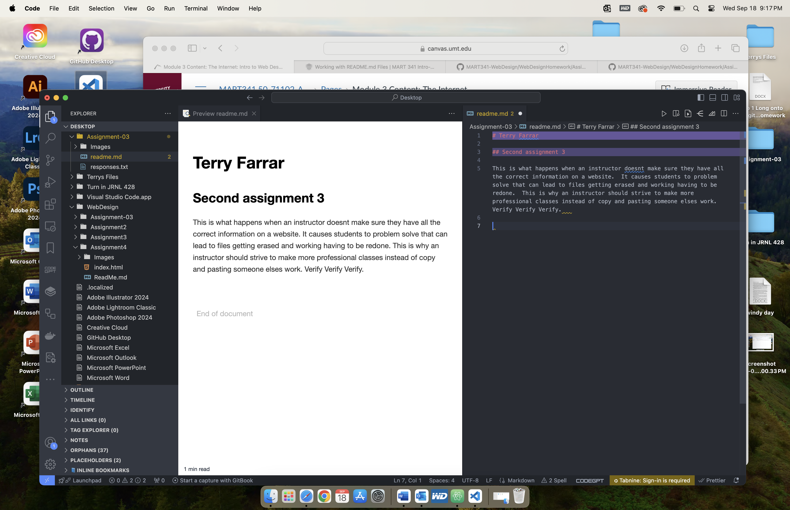

# Terry Farrar

## Second assignment 3

This is what happens when an instructor doesnt make sure they have all the correct information on a website.  It causes students to problem solve that can lead to files getting erased and working having to be redone.  This is why an instructor should strive to make more professional classes instead of copy and pasting someone elses work.  Verify Verify Verify.   

[Adorama](https://www.adorama.com)

[My File](./responses.txt)

